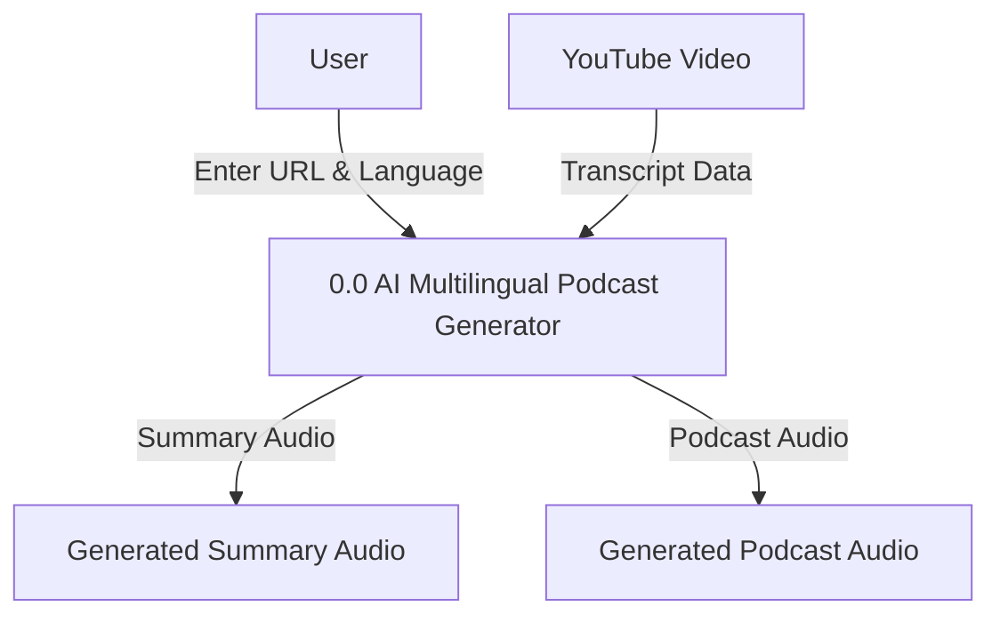
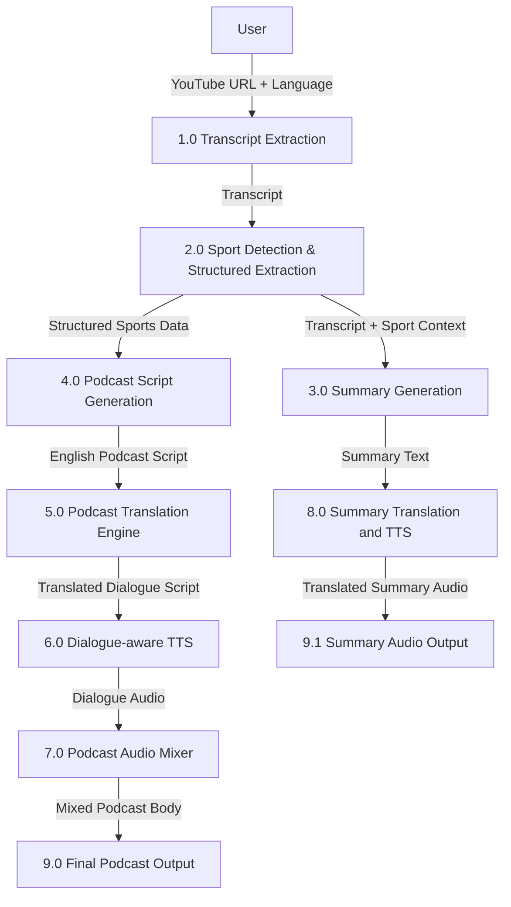
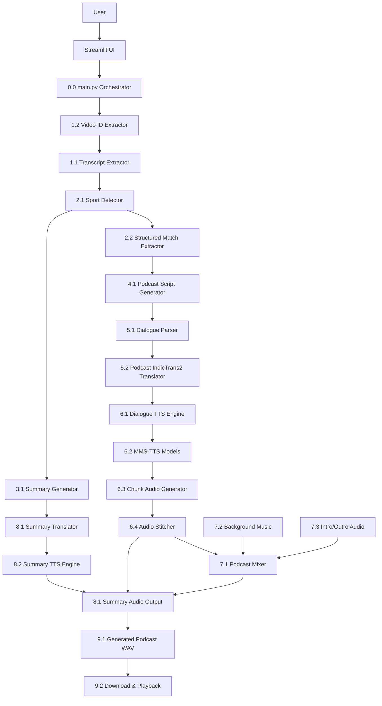
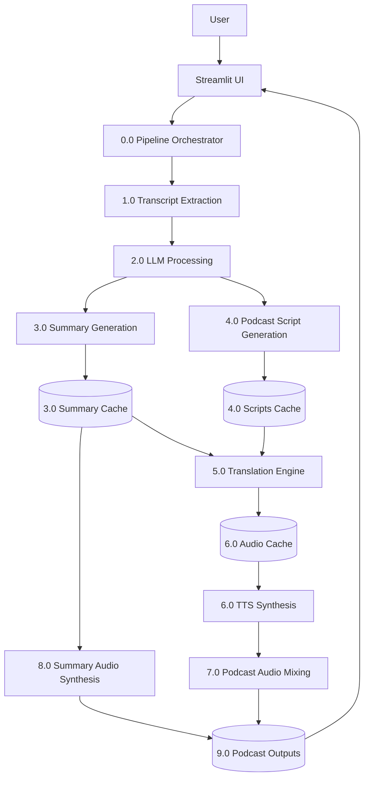
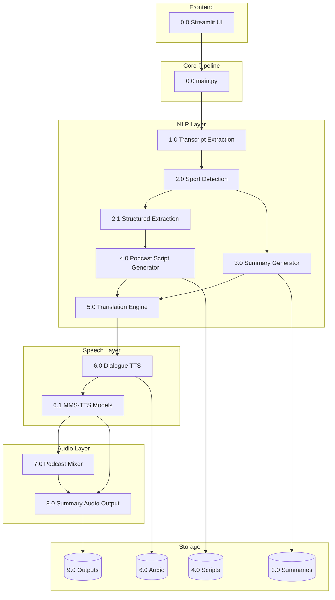
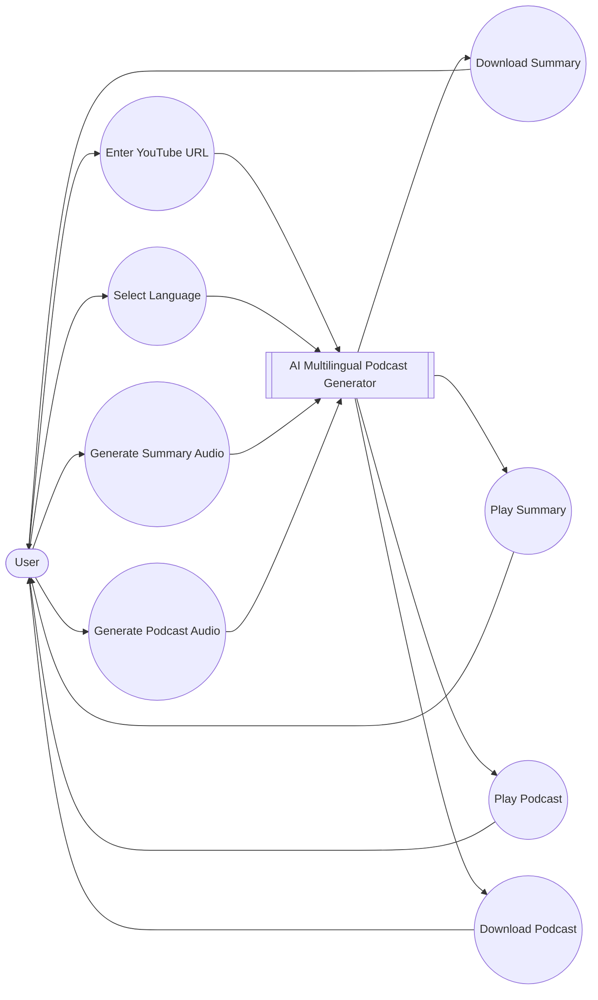
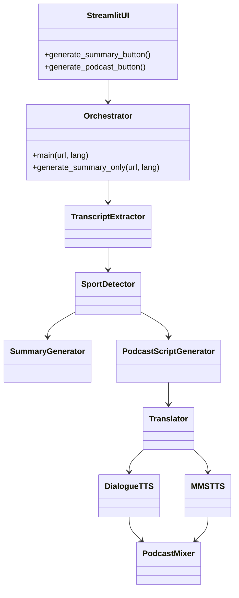
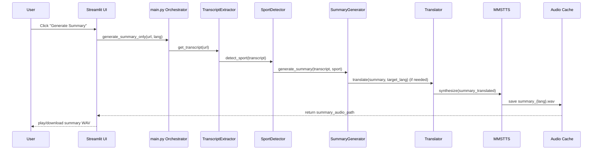
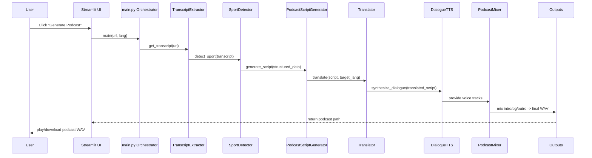

# 🎯 DFDs (Data Flow Diagrams) for AI Multilingual Podcast Generator

Below are:

* Level 0 DFD
* Level 1 DFD
* Level 2 DFD

using:

# ✅ Mermaid diagrams

You can directly use these in:

* README
* documentation
* reports
* presentations

---

# ✅ Level 0 DFD (Context Diagram)

Shows the system as a single black-box process.

---

# ✅ Level 1 DFD

Breaks the system into major modules.

---

# ✅ Level 2 DFD (Detailed Internal Workflow)

This shows detailed internal architecture and module interaction.

---

# ✅ Level 2 DFD (With Storage/Caching)

This version includes:

* scripts cache
* summary cache
* audio cache
* outputs

---

# ✅ Component Architecture Diagram

This is useful for:

* GitHub README
* presentations
* software architecture explanation

---

# ✅ Use-Case Diagram

This diagram shows the main user interactions with the system.

# ✅ Class Diagram

This class diagram shows the primary modules and their relationships.

---

# ✅ Sequence Diagrams

Two primary flows are shown: Summary generation and Podcast generation.

## Generate Summary (user flow)

## Generate Podcast (user flow)

---

# ✅ Best Recommendation

For:

## 📄 README

use:

* Component Architecture Diagram
* Level 1 DFD

For:

## 📄 Report / Documentation

use:

* Level 0
* Level 1
* Level 2

For:

## 📄 PPT Presentation

use:

* Level 0
* Component Architecture

Those are the cleanest visually.
